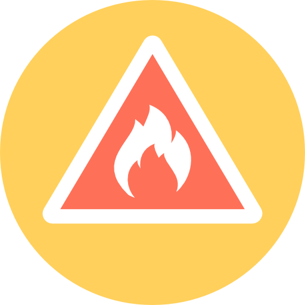

# Serious Games Coursework 

The serious games coursework was a chance for students to research and develop a 'Serious Game' that aims to teach a core subject to its player in an engaging way which is more enjoyable and memorable. A game that teaches basic fire training was developed and considerable research was done into the current state of fire training today.

## Assignment

The assignment as mentioned before was to develop a game that should then be submitted as an executable which can run on a standard windows machine. The game should successfully teach and validate knowledge using a in house online learning system. Research undertaken should also be submitted as a professional form of research.

## Submission

A full report setting out the research done and a runnable executable for the game were submitted as required. Additionally items such as the custom server and website which generates the PDF certification were also submitted alongside the main requirements.

## Features

* Four complete scenarios
* PDF certification generation
* Video playback for explaining lessons
* Full building modelled for scenario

## License

Apache 2.0